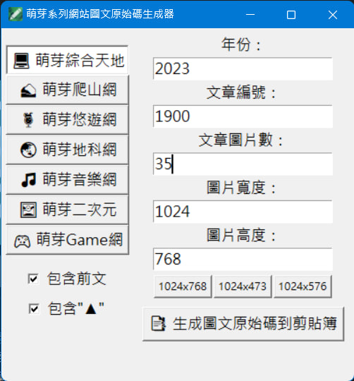

# 萌芽系列網站圖文原始碼生成器 - MNYA_WordCodeGen

為快速且方便生成萌芽系列網站之萌芽七大 WP 站圖文原始碼而誕生的小程式。 
自豪的使用 Python 開發，由萌芽站長與 ChatGPT 共同研究之結晶。

## 系統支援

Windows 10 64bit 以上

## 使用方式

1. 左側選擇準備撰寫圖文的網站 
2. 左側透過勾選方塊確認是否要包含前文及"▲" 
3. 右側分別輸入年份、文章編號、文章圖片數、圖片寬度、圖片高度 
4. 最後點擊「📑 生成圖文原始碼到剪貼簿」即可取得原始碼 

## 打包備註

如果要將 .py 檔案打包成可執行檔 .exe 需透過以下指令：
pyinstaller --onefile --icon=icon.ico --noconsole MNYA_WordCodeGen.py
