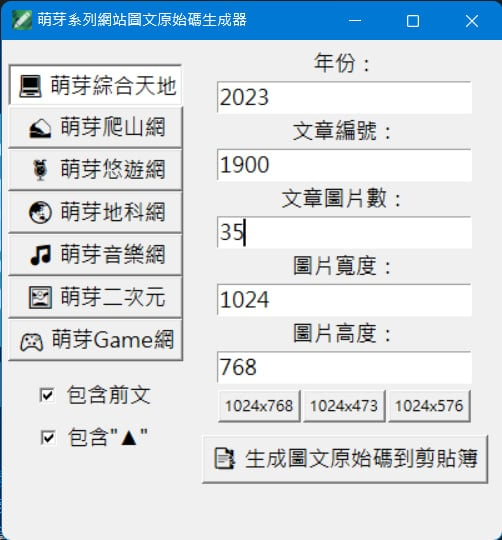

# 萌芽系列網站圖文原始碼生成器 - MNYA_WordCodeGen

為快速且方便生成萌芽系列網站之萌芽七大 WP 站圖文原始碼而誕生的小程式。 
自豪的使用 Python 開發，由萌芽站長與 ChatGPT 共同研究之結晶。

## 更新日誌

2025/06/06：V1.5.5 新增批次檔可於關於程式頁籤內執行程式更新 
2025/06/05：V1.5.4 影片重複淡化工具可以批次處理 
2025/06/05：V1.5.3 美化批次處理、複製取用、快速連結三個頁籤 UI 
2025/06/04：V1.5.2 加入主視窗最小寬高、建立 changelog.txt 將更新日誌從主程式獨立出來 
2025/06/03：V1.5.1 批次處理頁籤內新增影片重複淡化工具(子視窗開啟) 
2025/06/03：V1.5.0 批次處理所有功能模組化 
2025/03/12：V1.4.5 影片萌芽浮水印功能 BUG 修復 
2025/03/12：V1.4.4 批次處理頁籤內新增影片萌芽浮水印功能 
2025/03/12：V1.4.3 批次處理頁籤內新增 WEBP 轉 MP4 功能 
2025/02/21：V1.4.2 程式碼 BUG 修復 
2025/02/21：V1.4.1 增加輸入欄位上下箭頭調整純數字數值功能 
2025/02/19：V1.4.0 增加自動記憶及讀取各網站上次填入之文章編號功能 
2025/02/18：V1.3.9 批次處理頁籤內新增圖片中心處理功能 
2023/03/28：V1.3.8 修正錯誤 
2023/03/28：V1.3.7 批次處理頁籤內新增萌芽網頁浮水印功能 
2023/03/25：V1.3.6 批次處理頁籤內新增圖片左右分割後上下合併功能 
2023/03/23：V1.3.5 複製取用、快速連結內容更新 
2023/03/20：V1.3.4 批次處理頁籤內新增音訊合併功能，需依賴 ffmpeg.exe 及 ffprobe.exe 
2023/03/20：V1.3.3 批次處理頁籤內新增航跡檔轉航點座標功能 
2023/03/19：V1.3.2 新增快速連結頁籤 
2023/03/18：V1.3.1 新增複製取用頁籤 
2023/03/18：V1.3 新增設定頁籤，新增啟動時最小化功能 
2023/03/18：V1.2.3 主要功能新增勾選選項「包含"▼"」，與「包含"▲"」只能擇一 
2023/03/17：V1.2.2 批次處理頁籤內新增字幕檔轉時間軸標記功能 
2023/03/17：V1.2.1 自動記憶上次關閉前的視窗位置 
2023/03/16：V1.2 新增批次處理頁籤，新增圖片倆倆合併功能 
2023/03/15：V1.1 樣式美化，新增頁籤，預設採用暗黑模式 
2023/03/15：V1.0 初始版釋出 

## 系統支援

Windows 10 64bit 以上

## 使用方式

1. 左側選擇準備撰寫圖文的網站 
2. 左側透過勾選方塊確認是否要包含前文及"▲" 
3. 右側分別輸入年份、文章編號、文章圖片數、圖片寬度、圖片高度 
4. 最後點擊「📑 生成圖文原始碼到剪貼簿」即可取得原始碼 

## 打包備註

如果要將 .py 檔案打包成可執行檔 .exe 需透過以下指令： 
pyinstaller --onefile --icon=icon.ico --noconsole MNYA_WordCodeGen.py 

超快速懶人打包指令（請先關閉程式）： 
start run.bat 

## 舊版本截圖

#### V1.3.1 GUI 截圖

#### V1.3 GUI 截圖

#### V1.2.3 GUI 截圖

#### V1.2 GUI 截圖

#### V1.1 GUI 截圖

#### V1.0 GUI 截圖

# MIT License

Copyright (c) 2025 Feng, Cheng-Chi (萌芽站長) @ 萌芽系列網站 ‧ Mnya Series Website ‧ Mnya.tw

Permission is hereby granted, free of charge, to any person obtaining a copy
of this software and associated documentation files (the "Software"), to deal
in the Software without restriction, including without limitation the rights
to use, copy, modify, merge, publish, distribute, sublicense, and/or sell
copies of the Software, and to permit persons to whom the Software is
furnished to do so, subject to the following conditions:

The above copyright notice and this permission notice shall be included in all
copies or substantial portions of the Software.

THE SOFTWARE IS PROVIDED "AS IS", WITHOUT WARRANTY OF ANY KIND, EXPRESS OR
IMPLIED, INCLUDING BUT NOT LIMITED TO THE WARRANTIES OF MERCHANTABILITY,
FITNESS FOR A PARTICULAR PURPOSE AND NONINFRINGEMENT. IN NO EVENT SHALL THE
AUTHORS OR COPYRIGHT HOLDERS BE LIABLE FOR ANY CLAIM, DAMAGES OR OTHER
LIABILITY, WHETHER IN AN ACTION OF CONTRACT, TORT OR OTHERWISE, ARISING FROM,
OUT OF OR IN CONNECTION WITH THE SOFTWARE OR THE USE OR OTHER DEALINGS IN THE
SOFTWARE.
